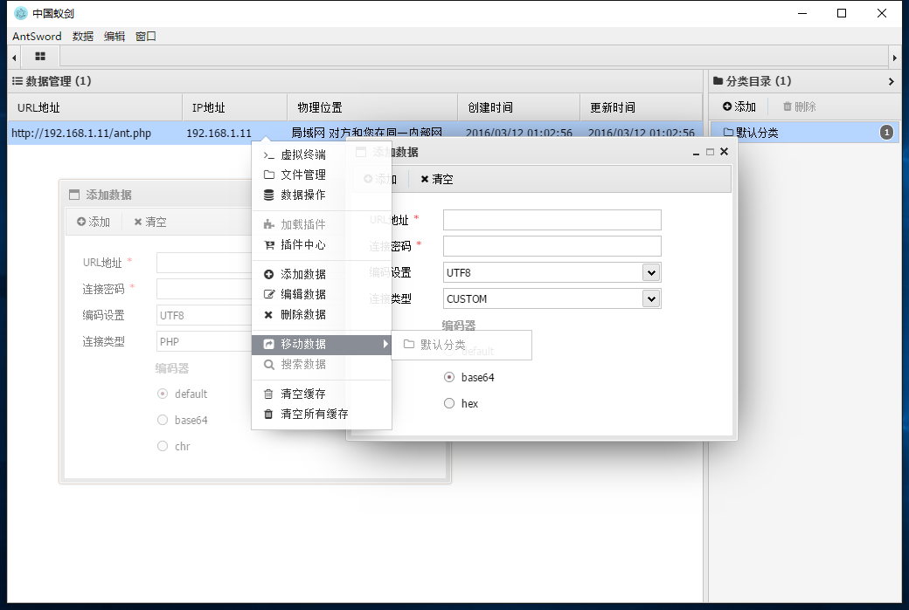

# AntSword - 中国蚁剑
> 一剑在手，纵横无忧！

**中国蚁剑是一款开源的跨平台网站管理工具，它主要面向于合法授权的渗透测试安全人员以及进行常规操作的网站管理员。**    
**任何人不得将其用于非法用途以及盈利等目的，也禁止未经允许私自修改打包进行发布，否则后果自行承担并将追究其相关责任！**

[](https://nodejs.org/en/download/)
[](https://github.com/antoor/antSword/releases/tag/1.1.0)

## 设计思想
> 中国蚁剑采用了[Electron](http://electron.atom.io/)作为外壳，`ES6`作为前端代码编写语言，搭配`Babel`&&`Webpack`进行组件化构建编译，外加`iconv-lite`编码解码模块以及`superagent`数据发送处理模块还有`nedb`数据存储模块，组成了这个年轻而又充满活力的新一代大杀器。

这里附上一个简单的开发思维导图，让大家了解蚁剑是如何工作的：


如图所示，中国蚁剑推崇模块化的开发思想，遵循着**开源，就要开得漂亮**的原则，致力于为不同层次的人群提供最简单易懂、方便直接的代码展示及其修改说明，努力让大家可以一起为这个项目贡献出的力所能及的点点滴滴，让这款工具真正能让大家用得顺心、舒适，让它能为大家施展出最人性化最适合你的能力。

## 开始使用
如果你是个正常使用普通用户，不需要关心代码如何编写以及没有改动等需求，那可以进入[release](https://github.com/antoor/antSword/releases)页面，选择你的系统版本进行下载对应压缩包，解压使用即可！

> **注意**: OSX因安全设置，可能在运行时提示未知开发者而无法运行，此时进入系统偏好设置->安全性与隐私->通用->允许任何来源的程序运行即可。

如果你是个喜欢编码喜欢个性化的自由主义者，那么，欢迎一起探讨学习，一起打怪升级！

### 下载源码
``` sh
$ git clone https://github.com/antoor/antSword.git
$ cd antSword
```

### 安装模块
``` sh
$ npm install
```
> 安装`electron-prebuilt`模块过程中会自动下载`electron`程序，由于网络原因下载速度可能较慢，此时不要终止结束安装，如若不小心在没下载完成之前`Ctrl+C`结束掉了安装脚本，那只需要重新卸载此模块在此安装即可。
> 如果遇到问题（国内速度慢）
```sh
$ npm install -g cnpm -—registry=https://registry.npm.taobao.org
$ cnpm install electron-prebuilt@0.36.11
$ npm install 
```


注意到源码目录的`source`目录了吗？对，我们主要的修改点就是它啦！    
**目前开发文档指南正在抽空编写中，各位可自行提前研究**    
在修改后，我们需要进行一项重要的操作：编译！否则修改会无法起效～

### 编译源码
``` sh
$ npm run build
```
> **提示**：你可以在执行编译的时候不关闭终端窗口保持监听编译进程，然后在修改源码保存后即可实时进行编译处理，此时重启应用就可以看到效果啦。

### 启动应用
``` sh
$ npm start
```
> **提示**：应用启动后，如果修改了代码并进行了编译处理，则可不必关闭应用再重新打开。    
> 直接点击菜单栏的调试->重启应用或者快捷键`Ctrl+R`刷新页面即可。

### 应用截图
> 如果在没开始之前瞧瞧这款工具都能干些什么，那么，就瞅瞅这几张截图提前了解吧！

#### 数据配置管理

#### 虚拟终端

#### 文件管理

#### 数据库管理


## 开发进度
**本项目起始于2015年底的一个小想法：**
使用浏览器访问我们的一句话eval服务端脚本，然后通过浏览器加载一条JS资源，将其页面转换为具有全功能的管理控制面板。    
后来在编写中发现，有一个问题很难解决：**编码**    
前端处理编码比较复杂，以本人目前功力暂无法突破，只能暂时使用服务端进行处理实现。

所以，这个使用`Electron`进行包装的工具就出现了。    
其中有优点也有缺点，比如跨平台支持、数据编码存储操作方便，比如文件过大、好像没啥缺点了。    

但不管怎样，时代在进步，我相信这款工具也能跟随着大家一起进步。    
我不追求它功能有多强大，能否名扬万里，能否取代xxx，只希望它对每一位使用者都能提供帮助，能让每一位爱好者都能学到点滴。    

目前功能已经完成了三大主流脚本的支持，包括`php`、`asp`、`aspx`以及自定义`custom`脚本，还有三大主要功能模块的实现，包括`文件管理`、`虚拟终端`、`数据库管理`以及正在开发中的`插件中心`等核心功能。    
虽能满足基本的需求，但因测试有限，仍有部分BUG等待解决。

> 目前版本所有的脚本代码均来源于伟大的**中国菜刀**，本人只是进行了解密以及一些改动，在此感谢作者并向其致敬！致敬每一位为网络安全做出贡献的新老前辈！

## 开源协议
本项目遵循`MIT`开源协议，详情请查看[LICENSE](LICENSE)。

## 加入我们
> 我们欢迎对本工具有兴趣、有追求、有能力改进的人才加入，一起学习探讨深入研究！

**你可以通过下列方式加入我们**:

* Q群： [130993112](http://shang.qq.com/wpa/qunwpa?idkey=51997458a52d534454fd15e901648bf1f2ed799fde954822a595d6794eadc521)
* 官网： [http://uyu.us](http://uyu.us)
* 微博： [蚁逅](http://weibo.com/antoor) 
